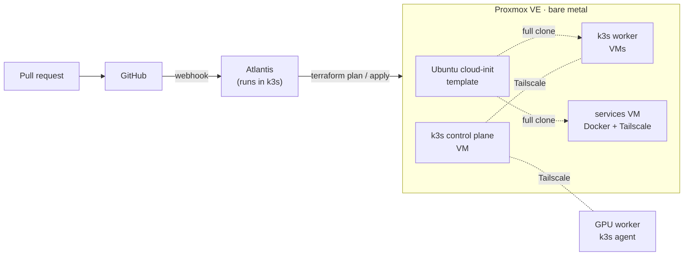

# homelab-infra

Infrastructure as code for my homelab: a private cloud on a bare-metal Proxmox host.
Terraform provisions VMs from a cloud-init template, a k3s cluster spans machines
over a Tailscale overlay (including a GPU worker node), and Atlantis runs Terraform from pull requests.

**Stack:** Proxmox VE · Terraform (bpg/proxmox) · cloud-init · Kubernetes (k3s) ·
Tailscale · Atlantis · Argo CD · GitHub Actions · Prometheus · Grafana ·
NVIDIA device plugin

## Architecture

- **Proxmox** is the virtualization layer on bare metal. VMs are full clones of an
  Ubuntu cloud-init template, and Terraform sets their size, disks and addresses.
  cloud-init bootstraps each VM on first boot.
- **k3s** runs across the Proxmox VMs and a GPU worker node, joined over
  **Tailscale**. The NVIDIA device plugin exposes the GPU to pods as
  `nvidia.com/gpu`.
- **Atlantis** runs inside the cluster. A pull request that changes Terraform gets
  its `plan` posted as a comment, and an `atlantis apply` comment applies it.
- **Argo CD** delivers workloads to the cluster from Git, and **Prometheus +
  Grafana** with node_exporter collect hardware metrics from the nodes.

## What's in this repo

| Path | What it is |
| --- | --- |
| [`environments/services/`](environments/services) | Terraform for the services VM: a full clone of the cloud-init template (4 vCPU, 8 GB RAM, 64 GB disk, static IP) and a cloud-init snippet that installs Docker, Tailscale and the QEMU guest agent and lays out directories for the self-hosted apps (Vaultwarden, Immich, Homarr, File Browser, Portainer) |
| [`atlantis/`](atlantis) | Kubernetes manifests that run Atlantis in the cluster. The GitHub token, webhook secret, and the Proxmox and VM passwords come from a Kubernetes Secret, and the repo allowlist is limited to this repository |
| [`atlantis.yaml`](atlantis.yaml) | Atlantis project config: autoplan when `.tf` or `.tfvars` files change |
| [`k8s/gpu/`](k8s/gpu) | The NVIDIA device plugin DaemonSet and a [step-by-step guide](k8s/gpu/Readme.md) to exposing the GPU to pods over Tailscale: RuntimeClass, node labels, verification and troubleshooting |

## Change workflow

1. Change Terraform on a branch and open a pull request.
2. Atlantis plans the affected project and posts the plan on the pull request.
3. Comment `atlantis apply` to apply it, then merge (automerge is off).

## GPU worker

The GPU node joins the cluster as a k3s agent over Tailscale. k3s 1.34 detects the
NVIDIA container toolkit on its own, so the setup comes down to a `RuntimeClass`, a
node label and the device plugin. The [GPU guide](k8s/gpu/Readme.md) walks through
it, including the `--advertise-address` and `--node-ip` flags that make k3s use
Tailscale addresses instead of LAN ones, and the failure modes hit along the way.
